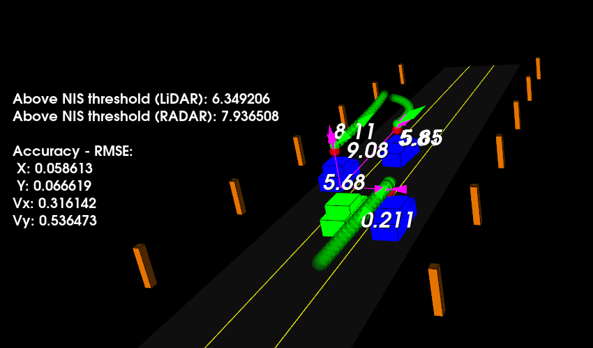

# Unscented Kalman Filter
### (based on [Sensor Fusion Nanodegree Program](https://www.udacity.com/course/sensor-fusion-engineer-nanodegree--nd313))



Simple (KF) and Unscented (UKF) Kalman Filters were implemented in this project to estimate the state of multiple cars on a highway using noisy LiDAR and RADAR measurements.
These filters use constant turn rate and velocity magnitude model (CTRV).
RMSE metric was chosen to estimate the accuracy of the position and the velocity estimations.
Normalized Innovation Squared (NIS) is calculated as an additional estimator of the Kalman Filters performance.


The visualization environment was created by [Aaron Brown](https://github.com/awbrown90). It allows to create a straight 3 lane highway environment with 3 traffic cars and the main ego car at the center. 
The viewer scene is centered around the ego car and the coordinate system is relative to the ego car as well. The ego car is green while the 
other traffic cars are blue. The traffic cars will be accelerating and altering their steering to change the lanes. Each of the traffic car's has
its own UKF objects created (for the LiDAR and the RADAR), which will update the state of each individual one during every time step. 

The red spheres above the cars represent the (x,y) lidar detection and the purple lines show the radar measurements with the velocity magnitude along the detected angle. The Z axis is not taken into account for tracking.
<br>The green spheres and arrows above the cars represent the predicted values of the respective values.

RMSE and NIS values are displayed for every time step. The following threshold values were selected for the errors:
* X position: 0.30,
* Y position: 0.16,
* X velocity: 0.95,
* Y velocity: 0.70

If the error reaches any of the thresholds after the simulator has run for longer than 1 second an appropriate message will be additionally displayed.

A user can additionally select the following options using interactive CLI prompts:
* Weather to use Unscented Kalman Filter for LiDAR measurements update or its 'simple' variant;
* Predicted time of the future car states in seconds;
* Predicted position interpolation frequency;

## Environment
Current application has been built on:

* Ubuntu 22.04
* PCL - v1.14.1
* C++ v14
* gcc v11.4

**Note** The PCL library has been built from the [source code](https://github.com/PointCloudLibrary/pcl)
as the one installed with apt gives segmentation error. For Mac users:
[PCL Mac Compilation Docs](https://pcl.readthedocs.io/projects/tutorials/en/latest/compiling_pcl_macosx.html#compiling-pcl-macosx)

## Basic Build Instructions

1. Clone this repo:
```sh
 cd ~
 git clone https://github.com/cr0mwell/Unscented_Kalman_Filters.git
```
2. Make a build directory: `cd Unscented_Kalman_Filters && mkdir build && cd build`
3. Compile: `cmake .. && make`
4. Run: `./ukf_highway`